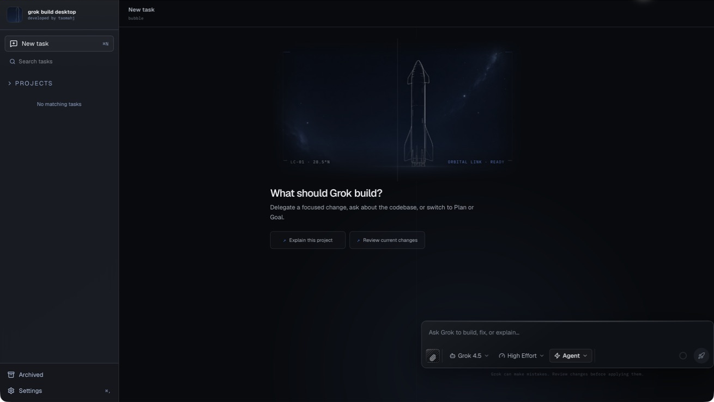
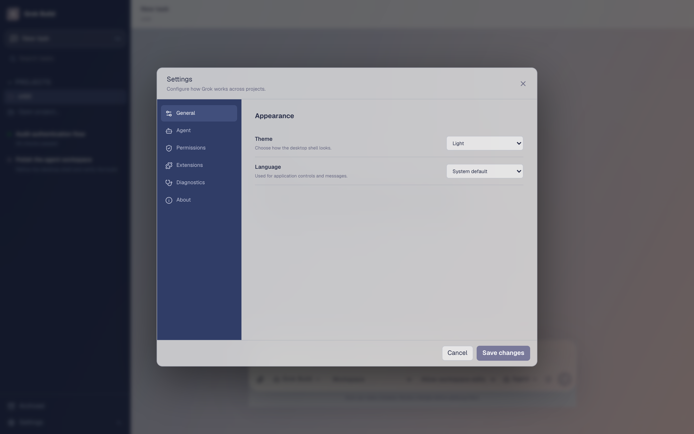
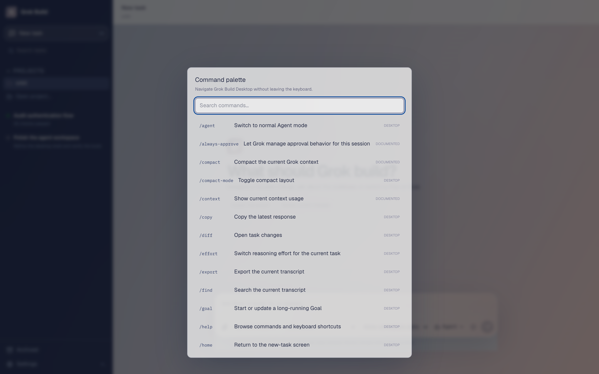

# Grok Build Desktop

> A local-first, open-source macOS control plane for reliable [Grok Build](https://docs.x.ai/build/overview) coding agents.  
> 面向官方 Grok Build CLI 的本地优先、开源 macOS 桌面控制台。

[](LICENSE)
[](#download--安装)
[](https://github.com/TAOMA-06/grok-build-agent/releases)

English · [中文](#中文)

This is an **unofficial community project** and is **not affiliated with, endorsed by, or sponsored by xAI or SpaceX**. Grok, xAI, SpaceX, and related names and marks belong to their respective owners.

本项目为**非官方社区项目**，与 xAI 或 SpaceX **不存在官方关联、认可或赞助关系**。Grok、xAI、SpaceX 及相关名称与标识归各自权利方所有。

---

## Latest compatibility · Grok Build CLI v0.2.103

Grok Build Desktop now tracks the latest Grok Build CLI workflow with:

- A multiline desktop composer for normal chat-style prompts
- `PageUp` / `PageDown` transcript scrolling while the composer is focused
- CLI-aware `/vim-mode` discovery in the command palette when that command is advertised
- Queued follow-up prompts during a running Grok turn, with an explicit queued state and a separate Stop control
- A read-only Cursor, Claude Code, and Codex compatibility matrix sourced from `grok inspect --json`; it never imports or transmits third-party sessions

The official Grok Build CLI remains the runtime and authentication owner; this project does not bundle, replace, or emulate it.

### 最新适配 · Grok Build CLI v0.2.103

Grok Build Desktop 已适配最新 Grok Build CLI 工作流，新增：

- 支持多行输入的桌面任务编辑器
- 输入框聚焦时，可用 `PageUp` / `PageDown` 滚动当前对话
- 当 CLI 声明支持时，命令面板会提供 `/vim-mode` 快捷入口
- Grok 运行期间可排队后续消息，时间线会明确显示排队状态，并保留独立的停止控制
- 通过 `grok inspect --json` 只读显示 Cursor、Claude Code 与 Codex 的兼容性矩阵；不会导入或传输第三方会话

官方 Grok Build CLI 仍负责运行与登录；本项目不会打包、替代或模拟该 CLI。

---

## Screenshots · 截图

<p align="center">
  
</p>

<p align="center">
  
  &nbsp;
  
</p>

| | |
|---|---|
| **Workspace** · 工作区 | Deep-space mission workspace with project navigation, a multiline composer, and Agent / Plan / Goal controls. |
| **Settings** · 设置 | Alloy configuration deck for theme, language, agent, permissions, extensions, and diagnostics. |
| **Command palette** · 命令面板 | Carbon avionics layer for keyboard-first `/plan`, `/effort`, `/diff`, and CLI-aware `/vim-mode`. |

---

## Download · 安装

### Apple Silicon (M1 / M2 / M3 / M4 /M5)

Download the latest **macOS arm64** build from Releases:

**→ [GitHub Releases](https://github.com/TAOMA-06/grok-build-agent/releases/latest)**

Artifact name:

- `Grok-Build-Desktop-<version>-macos-arm64.zip`

Install:

1. Unzip the archive.
2. Drag **Grok Build Desktop.app** into `/Applications`.
3. First launch: right-click the app → **Open** (ad-hoc signed; Gatekeeper may warn until you approve once).
4. Install / sign in to the official **Grok CLI** if prompted (`grok login --oauth` or device auth).

Requirements:

- macOS 12+
- Apple Silicon Mac
- Official [Grok Build CLI](https://docs.x.ai/build/overview) (not bundled)

> Universal / Intel builds and Apple notarization need signing secrets in CI. This release ships a local **arm64** package for Apple Silicon first.

---

## English

### What it is

Grok Build Desktop turns the official Grok Build CLI into a dependable desktop coding workspace. The CLI remains the execution runtime and owns Grok authentication; this app is the control plane: projects, tasks, permissions, isolated worktrees, terminals, diffs, event history, and crash recovery.

### Highlights

- Project / task sidebar with running, attention, completed, and archived states
- Independent Agent Host sidecar — closing the UI does not kill confirmed work
- Concurrent ACP sessions with crash recovery and event replay
- Automatic Git worktrees and explicit dirty-worktree choice
- Plan / Agent / Goal modes, reasoning effort, model picker, context usage
- Original Mission Control visual system with spacecraft artwork and reduced-motion support
- Markdown replies, tool activity, plans, permissions, MCP manager
- No product telemetry; workspace data stays on your Mac — see [PRIVACY.md](PRIVACY.md)

### Focus and privacy controls

- The first task instruction automatically becomes an editable **Task focus** in the Context drawer.
- **Economy** focus uses short task anchors and refreshes the full task contract less often; **Balanced** favors more regular full refreshes. Both show the injected token estimate and strategy in Context.
- New installs default to **Privacy Mode** on (Grok Build `/privacy opt-out`): coding session data is not used to train or improve the product. The app syncs this preference when an agent is connected and you are signed in. See [PRIVACY.md](PRIVACY.md).
- New installs default to **durable tasks** (Private Chat off) with **Orchestrator harness** on: task contracts, verification commands, orchestration rules, and session harness skills (Grok Build **0.2.103**) when the package path resolves.
- New tasks seed a structured **task contract** (goal, acceptance, inferred verify commands) and auto-run declared argv-only verifications after each turn when policy allows; shell, network, and destructive commands remain blocked pending confirmation.
- New installs default to **Medium** reasoning effort and **Strict Privacy Shield** to reduce recurring token use and protect common prompt secrets and high-risk attachments from accidental dispatch.
- Strict mode redacts detected API keys, access tokens, JWTs, and PEM private keys, and blocks high-risk attachment names. It is local protection only; account-level training is handled by Privacy Mode. See [PRIVACY.md](PRIVACY.md).

### Using the app

1. Open a project folder.
2. Describe the task and send it. The app prepares a worktree (for Git projects), starts ACP, and sends the prompt.
3. Run other tasks in parallel from the sidebar.
4. Review activity and diffs in the task drawer.
5. Use **Apply to project** when ready (dry-run first; apply only when preflight passes).

### Develop from source

```bash
cd apps/desktop
npm install
npm run app:dev
```

Quality gate:

```bash
cd apps/desktop && npm run check
cd src-tauri && cargo test --workspace
```

More: [architecture](docs/architecture.md) · [release](docs/release.md) · [ACP mapping](docs/acp-mapping.md) · [SECURITY](SECURITY.md) · [THREAT_MODEL](THREAT_MODEL.md)

**Contact:** [taomahj834225@outlook.com](mailto:taomahj834225@outlook.com)

---

## 中文

### 这是什么

Grok Build Desktop 把官方 Grok Build CLI 变成可用的桌面编程工作区。CLI 仍是执行运行时并负责 Grok 登录；本应用是控制面：项目、任务、权限、隔离 worktree、终端、diff、事件历史与崩溃恢复。

### 主要能力

- 项目 / 任务侧边栏：运行中、需关注、已完成、已归档
- 独立 Agent Host：关掉窗口也不会中断已确认的任务
- 多会话 ACP，支持崩溃恢复与事件回放
- Git 项目自动 worktree，脏工作区需显式选择策略
- Plan / Agent / Goal 模式、推理强度、模型选择、上下文用量
- 原创航天任务控制台视觉、飞行器背景与减少动态效果支持
- Markdown 回复、工具活动、计划审批、权限确认、MCP 管理
- 无产品遥测，工作区数据留在本机 — 见 [PRIVACY.md](PRIVACY.md)

### 聚焦与隐私控制

- 首条任务指令会自动成为可在 Context 抽屉中编辑的**任务聚焦**。
- **经济**档使用短任务锚点，更少刷新完整任务合同；**均衡**档会更频繁刷新。两种档位都会在 Context 中显示注入策略和估算 Token。
- 新安装默认开启 **Privacy Mode（隐私模式）**（对齐 Grok Build `/privacy opt-out`）：编程会话数据不会用于训练或改进产品。Agent 已连接且已登录时会同步到账户。详见 [PRIVACY.md](PRIVACY.md)。
- 新安装默认可恢复任务（Private Chat 关）并开启 **编排 Harness**：任务合同、验证命令与计划/探索/验证引导默认生效。
- 新任务会种子化结构化**任务合同**（目标、验收、推断的验证命令）；仅 argv 形式且策略允许的声明验证会自动运行，shell、网络和破坏性命令仍需确认。
- 新安装默认使用**中等**推理强度与**严格隐私防护**，以降低重复 Token 消耗，并避免常见提示词密钥和高风险附件被意外发送。
- 严格模式会脱敏识别到的 API 密钥、访问令牌、JWT 和 PEM 私钥，并阻止高风险附件名称。这是本地保护；账户级训练由 Privacy Mode 管理。详见 [PRIVACY.md](PRIVACY.md)。

### 使用流程

1. 打开一个项目文件夹。
2. 描述任务并发送。应用会为 Git 项目准备 worktree、启动 ACP 并发送提示。
3. 可在侧边栏并行开启其他任务。
4. 在任务抽屉中查看活动与文件变更。
5. 确认无误后使用 **Apply to project**（先 dry-run，预检通过才写入主仓库）。

### 下载安装（Apple 芯片）

1. 打开 [Releases](https://github.com/TAOMA-06/grok-build-agent/releases/latest)，下载 `Grok-Build-Desktop-*-macos-arm64.zip`。
2. 解压后将 **Grok Build Desktop.app** 拖入「应用程序」。
3. 首次打开：右键 → **打开**（当前为 ad-hoc 签名，需手动允许一次）。
4. 如提示缺少 CLI，按引导安装官方 Grok CLI 并完成登录。

### 从源码开发

```bash
cd apps/desktop
npm install
npm run app:dev
```

**联系方式：** [taomahj834225@outlook.com](mailto:taomahj834225@outlook.com)

---

## Repository layout · 仓库结构

```text
apps/desktop/       React + Tauri 桌面应用
docs/               架构、发布说明与 README 截图
.github/workflows/  macOS CI / 签名发布流水线
LICENSE             MIT
```

## Contributors · 贡献者

- **[TAOMA-06](https://github.com/TAOMA-06)** (maintainer · 维护者) — [taomahj834225@outlook.com](mailto:taomahj834225@outlook.com)
- **[Cursor](https://cursor.com)** (AI-assisted development · AI 辅助开发)

## License · 许可

MIT — see [LICENSE](LICENSE).
