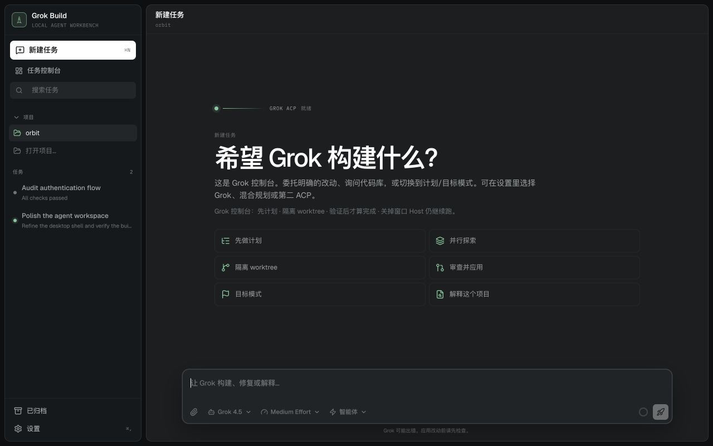
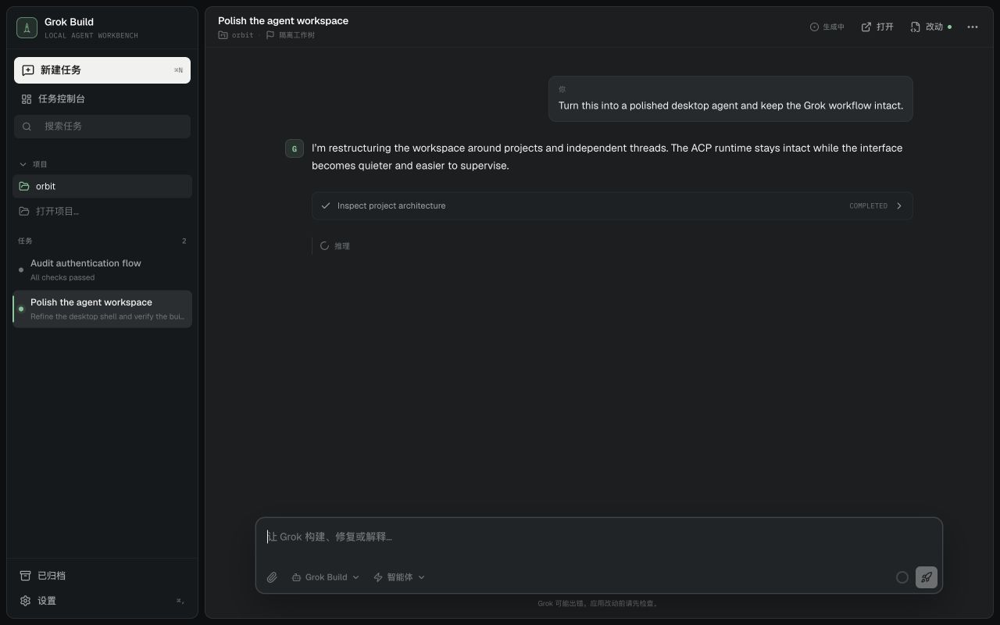
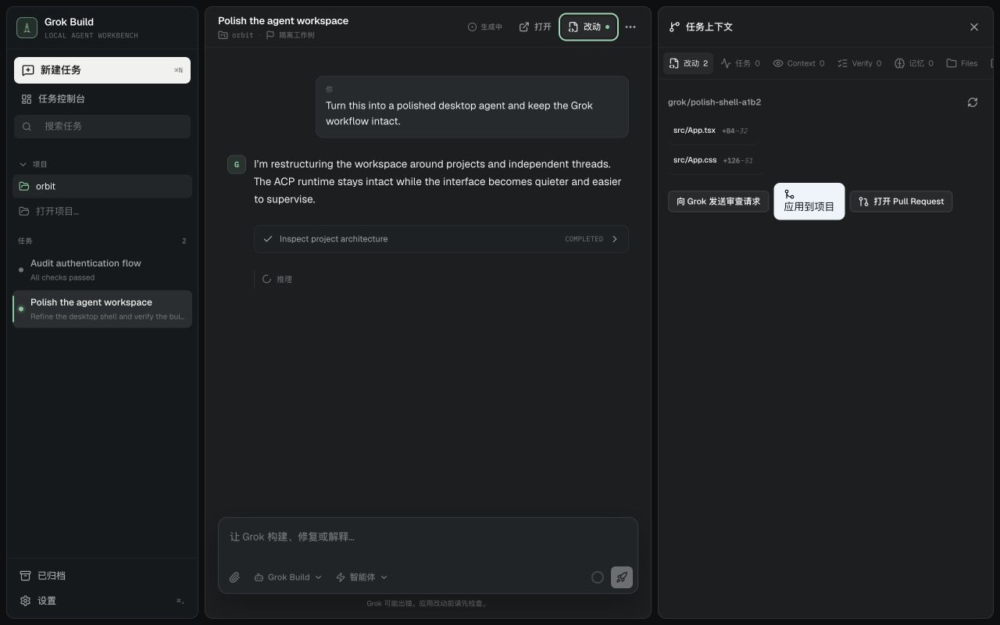
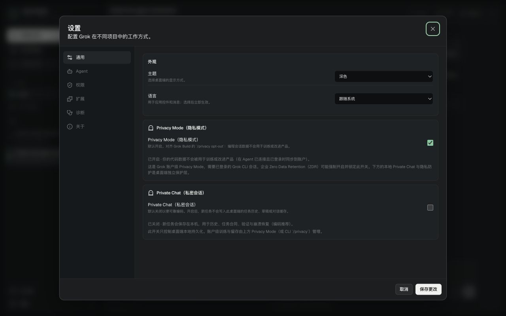
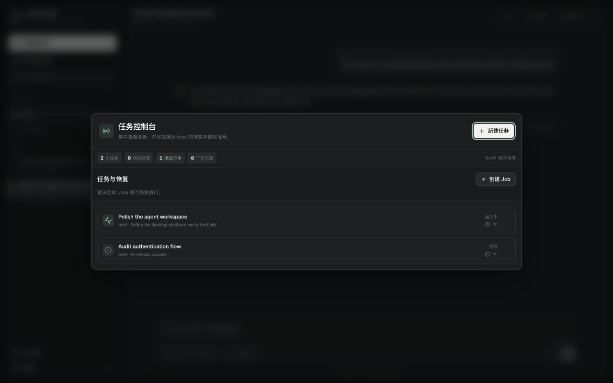
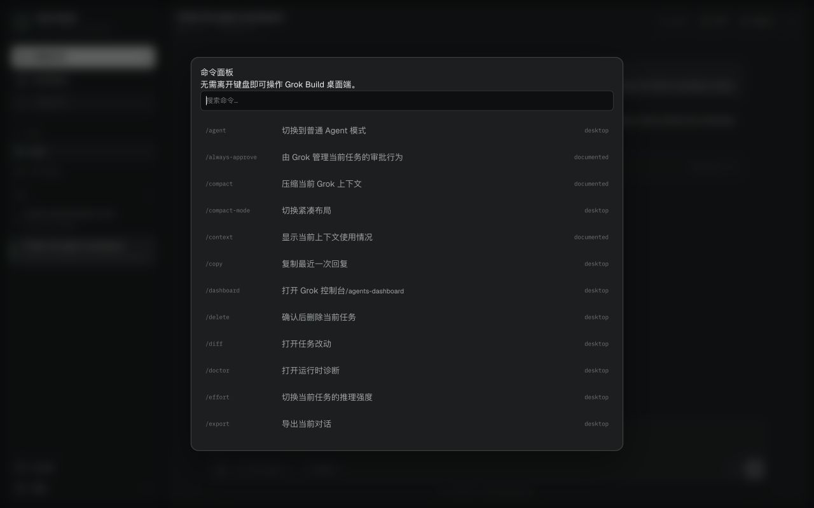

# Grok Build Desktop

> A local-first macOS **operator workbench** for the official [Grok Build CLI](https://docs.x.ai/build/overview). Organize projects, supervise parallel tasks, review changes, and keep the runtime boundary explicit.<br>
> 面向官方 Grok Build CLI 的本地优先 macOS **智能体工作台**：管理项目与并行任务、审查改动，并清楚区分桌面端、Agent Host 与外部运行时边界。

[](LICENSE)
[](#download--下载安装)
[](https://github.com/TAOMA-06/grok-build-agent/releases/latest)

Grok Build Desktop turns long-running coding-agent work into visible, reviewable tasks. The official Grok Build CLI remains the default execution and authentication owner; the desktop app adds project organization, durable task state, worktree isolation, approvals, review, verification, files, and task-scoped terminals.

Grok Build Desktop 把长时间运行的编码智能体工作变成可观察、可审查的任务。官方 Grok Build CLI 仍负责默认执行与登录；桌面端负责项目组织、任务恢复、worktree 隔离、审批、改动审查、验证、文件和任务级终端。

> [!IMPORTANT]
> This is an **unofficial community project** and is not affiliated with, endorsed by, or sponsored by xAI or SpaceX. Grok, xAI, SpaceX, and related marks belong to their respective owners.<br>
> 本项目为**非官方社区项目**，与 xAI 或 SpaceX 不存在官方关联、认可或赞助关系。

## Product tour · 产品预览

<p align="center">
  
</p>

<p align="center">
  
  
</p>

<p align="center">
  
  
</p>

<p align="center">
  
</p>

<p align="center"><sub>Screenshots use the built-in MockBridge demo data and reflect the current <code>main</code> UI. They do not expose local projects or claim that an unreleased build is already distributed. · 截图使用内置 MockBridge 演示数据，展示当前 <code>main</code> 界面，不包含本机项目，也不代表未发布构建已经对外分发。</sub></p>

## What it helps you do · 核心能力

| Surface | Capability | 能力说明 |
| --- | --- | --- |
| **Projects & tasks** | Group conversations by workspace; surface running, attention, idle, completed, and archived states. | 按工作区组织任务，并显示运行中、需关注、空闲、完成和归档状态。 |
| **Durable Agent Host** | Keep confirmed work alive when the window closes; recover sessions through event replay and persisted task state. | 关闭窗口后 Host 仍可继续已确认工作，并通过事件回放与持久化状态恢复任务。 |
| **Agent / Plan / Goal** | Switch task mode, model, and reasoning effort from one persistent Composer; queue follow-ups or stop a running turn. | 在同一个 Composer 中切换任务模式、模型和推理强度，支持排队后续消息与停止当前轮次。 |
| **Runtime choice** | Use Grok Build, mixed planning with a secondary ACP, or a secondary ACP for the entire task. | 可选择 Grok Build、第二 ACP 参与的混合规划，或整段任务使用第二 ACP。 |
| **Worktrees & Git review** | Create isolated worktrees, inspect diffs, stage/revert files or hunks, leave review guidance, apply with preflight, and prepare pull requests. | 自动隔离 worktree，审查 diff，处理文件或 hunk，添加审查意见，经预检后应用并准备 Pull Request。 |
| **Task Inspector** | Open Changes, Activity, Context, Verify, Memory, Files, and Terminal without leaving the task. | 在任务内查看改动、活动、上下文、验证、记忆、文件与终端。 |
| **Mission Control** | Supervise parallel tasks, Host jobs, recovery signals, approvals, and subagent activity from one surface. | 集中查看并行任务、Host Jobs、恢复信号、审批和子代理活动。 |
| **Permissions & privacy** | Route exact approval choices to the correct task; keep critical second-confirmation requests interactive even in full-auto mode. | 将精确审批选项路由到正确任务；即使开启全自动，高风险二次确认仍必须由用户处理。 |
| **Local privacy controls** | Privacy Mode sync, optional ephemeral Private Chat, local secret redaction, attachment checks, and no product telemetry. | 支持账户级隐私模式同步、可选临时私密会话、本地密钥脱敏、附件检查，并且不收集产品遥测。 |
| **Extensions & diagnostics** | Inspect models, adapters, MCP servers, skills, plugins, hooks, Host health, CLI health, and recovery tools. | 查看模型、适配器、MCP、技能、插件、Hooks、Host/CLI 健康状态与恢复工具。 |

## Runtime choices · 运行时选择

Choose the execution model in **Settings → Agent**:

- **Grok Build** — default; Agent, Plan, and Goal run on the official Grok Build CLI.
- **Mixed planning** — a secondary ACP (commonly Codex) drafts the plan; Grok implements after approval.
- **Secondary ACP** — the configured ACP binary runs the entire task.

在 **设置 → Agent** 中选择运行方式：

- **Grok Build** — 默认；Agent、Plan、Goal 均由官方 Grok Build CLI 执行。
- **混合规划** — 第二 ACP（通常为 Codex）负责起草计划，批准后交给 Grok 实施。
- **第二 ACP** — 整段任务由配置的 ACP 二进制运行。

The app does not bundle, replace, or emulate the official Grok Build CLI.

## Typical workflow · 典型流程

1. Open a project folder. · 打开项目文件夹。
2. Describe one concrete outcome. The app creates an isolated worktree for Git write tasks. · 描述一个明确结果；Git 写任务会准备隔离 worktree。
3. Run other tasks in parallel while the Agent Host maintains task state. · 并行运行其他任务，Agent Host 维护任务状态。
4. Inspect tool activity, permissions, verification evidence, files, terminal output, and diffs. · 检查工具活动、权限、验证证据、文件、终端和 diff。
5. Apply changes only after the worktree preflight is ready. · 仅在 worktree 预检通过后应用改动。

## Safety and privacy · 安全与隐私

- Worktree writes are isolated; dirty repositories require an explicit user choice.
- Shell, network, destructive, elevated, and out-of-scope path actions follow Host policy and approval rules.
- Critical requests cannot be silently persisted as always-allow rules.
- Strict Privacy Shield redacts common API keys, access tokens, JWTs, and private keys before local persistence or dispatch.
- High-risk attachment names are blocked in strict mode.
- **Private Chat** is an explicit local-ephemeral mode; it is separate from account-level Grok Privacy Mode.
- The product has no application telemetry. Workspace data stays on the Mac unless the chosen runtime or an explicitly configured external tool receives it.

More: [PRIVACY.md](PRIVACY.md) · [SECURITY.md](SECURITY.md) · [THREAT_MODEL.md](THREAT_MODEL.md)

## Compatibility · 兼容性

Current source targets Grok Build CLI **1.0.0–1.0.5** workflows, including:

- session `GROK_CONFIG` overlay for harness code indexing without editing the user's global config;
- bounded orchestration, workflows, Host jobs, `/usage`, `/recap`, `/undo` aliases, and non-overlapping loops when advertised by the live CLI;
- MCP enable/disable, live model discovery, reasoning effort, queued follow-ups, and honest unavailable/TUI-only command labels;
- a read-only external-tool compatibility matrix sourced from `grok inspect --json` without importing third-party sessions.

实际功能以当前安装的官方 CLI 能力为准。桌面端不会猜测未上报的模型、命令、登录方式或审批选项。

## Download · 下载安装

The latest published release is **v1.1.1**, distributed as a Developer ID–signed and Apple-notarized universal DMG for Apple Silicon and Intel Macs. This was verified against the current GitHub Release metadata.

当前公开版本为 **v1.1.1**，提供适用于 Apple Silicon 与 Intel Mac 的通用 DMG；GitHub Release 标记其已完成 Developer ID 签名与 Apple 公证。

**→ [Download from GitHub Releases · 前往 GitHub Releases](https://github.com/TAOMA-06/grok-build-agent/releases/latest)**

Artifact · 安装包：`Grok.Build.Desktop_<version>_universal.dmg`

Requirements · 环境要求：

- macOS 12 or later
- Apple Silicon or Intel Mac
- Official [Grok Build CLI](https://docs.x.ai/build/overview) — not bundled

Install · 安装：

1. Open the downloaded DMG.
2. Drag **Grok Build Desktop.app** into `/Applications`.
3. Launch the app normally and install/sign in to the official Grok CLI if prompted.

> [!NOTE]
> The app can check GitHub Release metadata, but it does **not** yet download, verify, replace, and relaunch itself. Updates remain a manual DMG install.<br>
> 应用可以检查 GitHub Release 元数据，但尚未实现下载、签名验证、替换和重启的完整自更新链路；更新仍需手动安装 DMG。

## Develop from source · 从源码开发

```bash
cd apps/desktop
npm install
```

Build, launch, and verify the real macOS app through the project entrypoint:

```bash
./script/build_and_run.sh --verify
```

Quality gates:

```bash
cd apps/desktop && npm run check
cd apps/desktop/src-tauri && cargo test --workspace
cd apps/desktop && npm run check:parity-eval
```

The latest local UI validation recorded **39 frontend test files / 193 tests** and **131 Rust tests** passing. The parity smoke remains provisional because 14/28 agent tasks require recorded external results. See [the validation record](docs/ui-redesign/2026-08-30-validation.md).

最近一次本地 UI 验证记录为：前端 **39 个测试文件 / 193 项测试**、Rust **131 项测试**通过。Parity smoke 仍为 provisional，因为 28 个 Agent 任务中有 14 个需要外部记录结果。

## Repository layout · 仓库结构

```text
apps/desktop/       React + Tauri desktop application
docs/               Architecture, security, release, validation, and screenshots
harness/            Optional orchestration package and workflows
script/             Canonical local build/run entrypoint
.github/workflows/  macOS CI and signed release automation
```

Architecture: [docs/architecture.md](docs/architecture.md) · [ACP mapping](docs/acp-mapping.md) · [release process](docs/release.md)

## Contact and contributing · 联系与贡献

Grok Build Desktop is independently maintained. Issues, pull requests, feedback, collaboration, and sponsorship enquiries are welcome.

- Maintainer: **[TAOMA-06](https://github.com/TAOMA-06)**
- Email: [taomahj834225@outlook.com](mailto:taomahj834225@outlook.com)

## License

MIT — see [LICENSE](LICENSE).
